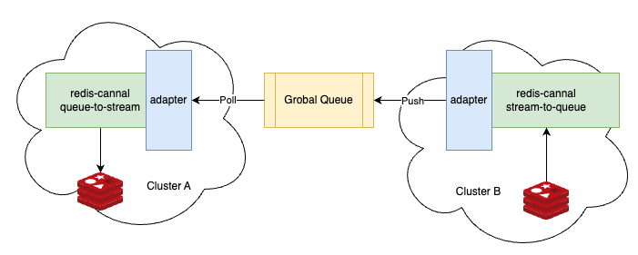

[](https://codecov.io/gh/Wh1isper/redis-canal)

# redis-canal

Proxy redis stream from one to another through global queue service.

Motivation: Redis provided on the cloud is usually only available within a VPC and does not provide external access. We want to provide a way to synchronize messages across clouds without going through a VPN.



## Supported queue service

- [x] AWS SQS

Welcome to contribute more queue service, see [adapter/impl](./redis_canal/adapter/impl/) for more details.

We also support the plugin system, the adapter can also be imported as a third-party library. See [example](./example/extension/custom-adapter/) for more details.

## Install

`pip install redis-canal[all]` for all components.

Or use docker image

`docker pull wh1isper/redis-canal`

## Usage

Use CLI

- `redis-canal stream-to-queue` to start a daemon to consume redis stream and push to global queue
- `redis-canal queue-to-stream` to pull from global queue and push to redis stream

CLI args support `envvar`, which you can refer to [envs.py](./redis_canal/envs.py).

## TODO

- More adapter for Google PubSub, Kafka, etc
- Allows users to more easily configure the adapter(Now only support environment variables, within `Adapter`)

## Develop

Install pre-commit before commit

```
pip install pre-commit
pre-commit install
```

Install package locally

```
pip install -e .[test]
```

Run unit-test before PR

```
pytest -v tests
```

### Develop sqs adapter

You need to configure your AWS account first. See [AWS CLI docs](https://docs.aws.amazon.com/cli/latest/userguide/cli-chap-configure.html) for more details.

Make sure your account has `sqs:*` permission. Then you can run `pytest -v tests/adapter/test_sqs_adapter.py` to test it.
